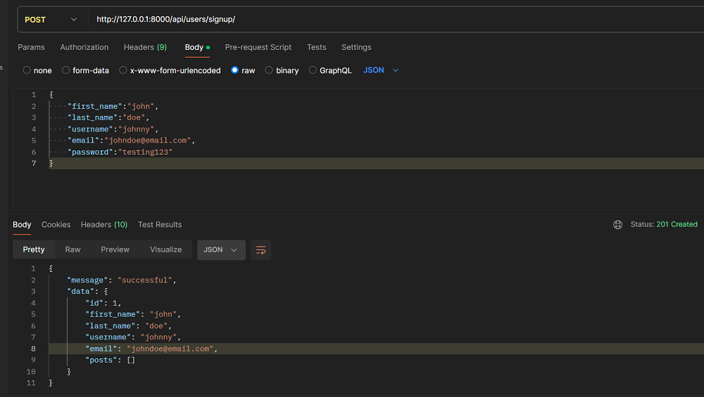
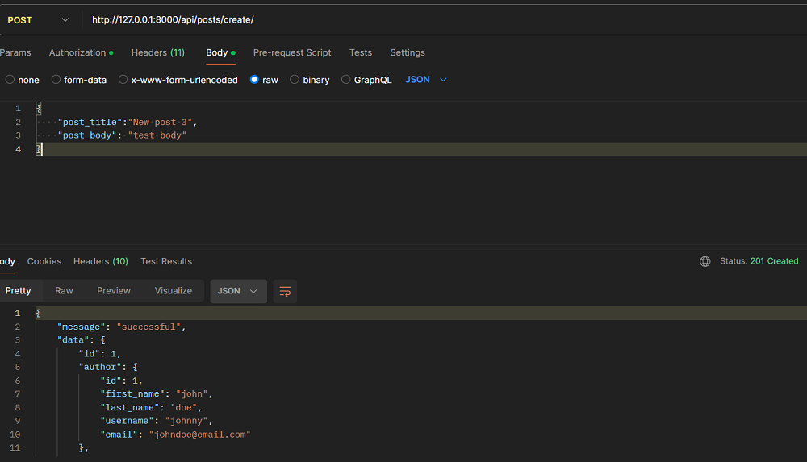

This tutorial will focus on exploring how to use DRF Blog Bridger within a Django REST Framework project. You will learn how to build a functional blog API with proper permission levels.

???+ note
    This tutorial assumes you have used Django REST Framework before. If you have not, consult the [official documentation](https://www.django-rest-framework.org/){:target=_blank} to get started.

## Step 1: Install and Set up `drf-blog-bridger`
Start by installing DRF Blog Bridger into your project's [virtual environment](https://www.geeksforgeeks.org/python-virtual-environment/){:target="_blank"}:

```bash
pip install drf-blog-bridger
```

After installation, add the following configurations to your settings file:

```python title="settings.py"

    INSTALLED_APPS = [

        'blog_bridger_drf',
        'rest_framework',
    ]

    REST_FRAMEWORK = {
        'DEFAULT_PERMISSION_CLASSES':[
            'rest_framework.permissions.IsAuthenticatedOrReadOnly',
        ]
    }
```
Also, add this to your project's `urls.py` file:

```python title="urls.py"
path('api/posts/', include('blog_bridger_drf.urls')),
```
Finally, run migrations to complete the installation:

```bash
python manage.py migrate
```

## Step 2: Create Your User Model and Serializer
DRF Blog Bridger has authentication restrictions which means you need to be logged in to perform certain operations such as creating posts. You should start by creating a new app for users. Run this command in your CLI:

```bash
python manage.py startapp users
```
After running the command above, add the following to your `INSTALLED_APPS` settings:
```python title="settings.py"
INSTALLED_APPS = [
    'users',
]
```
For the purpose of this tutorial, you can stick to the default user model in Django. However, Django REST Framework allows you to [define a custom user model](https://www.codingforentrepreneurs.com/blog/how-to-create-a-custom-django-user-model/){:target=_blank} if you need one.

After setting up your user model, create a new file called `seriaizers.py` within your `users` app. In your serializer file, you can create a serializer for your user like this:

```python title="users/serializers.py"
from rest_framework import serializers
from django.contrib.auth import get_user_model

User = get_user_model()

class UserSerializer(serializers.ModelSerializer):
    password = serializers.CharField(min_length=8, write_only=True)
    
    class Meta:
        model = User
        # add more fields if required
        fields=['id', 'first_name', 'last_name', 'username', 'email', 'password']
    
    def create(self, validated_data):
        user = User.objects.create_user(**validated_data)
        return user
```

If you want the above serializer to return the posts related to the user, you can use the `PostSerializer` in `drf-blog-bridger` to create a post field. Here's an example:

```python title="users/serializer.py"
from blog_bridger_drf.serializers import PostSerializer # new import

class UserSerializer(serializers.ModelSerializer):
    password = serializers.CharField(min_length=8, write_only=True)
    posts = PostSerializer(read_only=True, many=True) # create post field

    class Meta:
        ...
        fields = ['posts'] # populate this field as required
```

## Step 3: Create Authentication Views for Your User Model
Because `drf-blog-bridger` won't let users perform certain operations unless they authenticate themselves, you need to provide a way for your users to create accounts and log in to their accounts.

An easy way to achieve this is to use Simple JWT to authenticate users. Start by installing it with this CLI command:

```bash
pip install djangorestframework-simplejwt
```

After installing the Simple JWT package, add the following code to your settings file:

```python title="settings.py"
INSTALLED_APPS = [
    'rest_framework_simplejwt',
]
REST_FRAMEWORK = {
    'DEFAULT_AUTHENTICATION_CLASSES': (
        'rest_framework_simplejwt.authentication.JWTAuthentication',
    )
}
```

Once you are done with the configuration above, open your `users/views.py` file to create a signup view. Here's an example of such view:

```python title="users/views.py"
from rest_framework import generics, status
from rest_framework.response import Response
from rest_framework.request import Request

from .serializers import UserSerializer

class Signup(generics.GenericAPIView):
    serializer_class = UserSerializer
    permission_classes = ()

    def post(self, request:Request):
        serializer = self.serializer_class(data=request.data)
        if serializer.is_valid():
            serializer.save()
            response = {
                "message":"successful",
                "data": serializer.data
            }
            return Response(data=response, status=status.HTTP_201_CREATED)
        response = {
            "message":"failed",
            "info": serializer.errors
        }
        return Response(data=response, status=status.HTTP_400_BAD_REQUEST)
```
???+ Note
    Since we are using REST Framework Simple JWT, there is no need to manually create a login view. However, if you have peculiar needs, feel free to create your custom login view.

The above view will let you send a POST request to create an account for users using the fields you specified in your serializer. Feel free to add more features such as email authentication to your view.

## Step 4: Create URL Patterns for Your Views
URL patterns will enable your users to access and interact with your API. These steps will show you how to create URL patterns for your login and signup views. 

1. Add a URL pattern to your project-level `urls.py` file:

    ```python title="your_project/urls.py"
    from django.urls import path, include

    urlpatterns = [
        path('api/users/', include("users.urls")),
    ]
    ```

2. Create a new file within your user app. Call this app `urls.py`
3. Inside your new `urls.py` file, paste this code into it:
    ```python title="users/urls.py"
    from django.urls import path
    from rest_framework_simplejwt.views import TokenObtainPairView, TokenRefreshView

    from .views import Signup
    urlpatterns = [
        path('signup/', Signup.as_view(), name="signup"),
        path('login/', TokenObtainPairView.as_view(), name="login"),
        path('login/refresh/', TokenRefreshView.as_view(), name='token_refresh'),
    ]
    ```

The code snippet above uses the views available in `rest_framework_simplejwt` to create a `login/` URL pattern and a `login/refresh/` URL pattern. 

This means that whenever a user logs in to their account, they get a pair of tokens(access, and refresh tokens) to authenticate them. You can use the refresh token to create new access tokens. 

For more information, read the [official documentation of Django REST Framework Simple JWT](https://django-rest-framework-simplejwt.readthedocs.io/en/latest/index.html){target=_blank}.


## Step 5: Create a User and Test the `drf-blog-bridger` Endpoints
You can use a tool like [Postman](https://www.postman.com/){target=_blank} to access your endpoints. 

1. Firstly, you have to create a user and log in with that user. Here's a sample POST request data to create a new user:
    ```JSON
    {
        "first_name":"john",
        "last_name":"doe",
        "username":"johnny",
        "email":"johndoe@email.com",
        "password":"testing123"
    }
    ```
    You should send your request to `localhost:8000/api/users/signup`.

    <figure markdown="span">
    { loading=lazy }
    <figcaption>Creating a user with the signup endpoint</figcaption>
    </figure>

2. Next, use the username and password to log in. The login fields might be different if you're using a custom user model. You can use this data to send a POST request to the login endpoint:
    ```JSON
    {
        "username":"johnny",
        "password":"testing123"
    }
    ```
    <figure markdown="span">
    { loading=lazy }
    <figcaption>Accesing the login endpoint</figcaption>
    </figure>

3. Copy your access token and add it to the authorization header of your request. Since the API uses JWT, you should add your token as a bearer token. Postman provides information on [how to add bearer tokens](https://learning.postman.com/docs/sending-requests/authorization/authorization-types/#bearer-token){target=_blank}.

    In the image below, the access token is included in the [Create Post request available in `drf-blog-bridger`](../api_docs.md/#1-create-post)
    <figure markdown="span">
    { loading=lazy }
    <figcaption>Accesing the login endpoint</figcaption>
    </figure>

4. Now that you have an authenticated user, you will be able to access the `create/` endpoint in `drf-blog-bridger`. You can use this sample data to create your first post:

    ```json
    {
        "post_title":"New post 3",
        "post_body": "test body"
    }
    ```
    <figure markdown="span">
    { loading=lazy }
    <figcaption>Creating a new post</figcaption>
    </figure>
## Conclusion
In this tutorial, you have learned how to integrate the `drf-blog-bridger` package into a real-world project. You should continue integrating it into your project by accessing other endpoints defined in the [API reference](../api_docs.md).